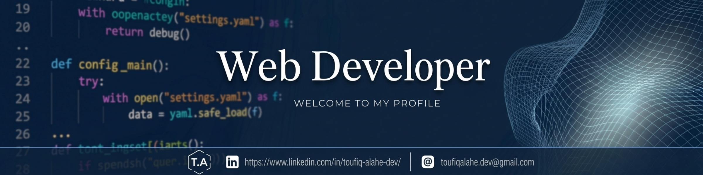

<h1 align="center">Hi 👋, I'm Toufiq Alahe  </h1>

<h3 align="center"> MERN Stack Developer | Building Scalable Web Applications | Clean & Efficient Code</h3>

<p align="center">
Solving real-world problems through clean code, intuitive design, and scalable architecture.
</p>

<div  align="center">

<a  href="https://www.linkedin.com/in/toufiq-alahe-dev/"></a>
<a  href="https://github.com/toufiqweb"></a>
<a  href="mailto:toufiqalahe.dev@gmail.com"></a>

</div>

<h2  align="center"> About Me</h2>


<div  align="center">

<strong>I’m a MERN Stack Developer focused on building fast, scalable, and user-friendly web applications. With expertise in MongoDB, Express.js, React.js, Next.js, and Node.js, I develop complete full-stack solutions that deliver both great user experiences and reliable performance. I’m solving real-world problems through code and continuously expanding my knowledge of modern web technologies.</strong>

</div>

<hr/>


### 🛠️ What I'm Up To

* 🚀 Building full-stack web applications using **MongoDB**, **Express.js**, **React.js**, **Next.js**, and **Node.js**.
* 🎨 Creating modern, responsive, and user-focused interfaces with **Tailwind CSS** and component-based architectures.
* 🔐 Implementing secure authentication, authorization, and RESTful API integrations.
* 📚 Continuously learning advanced full-stack development concepts, performance optimization, and scalable system design.
* 💻 Actively working on personal projects and improving my development skills through the **#100DaysOfCode** challenge.
* 📬 Reach me at: **[toufiqalahe.dev@gmail.com](mailto:toufiqalahe.dev@gmail.com)**
* 🌐 Portfolio: **[toufiqweb](https://toufiq-portfolio.vercel.app)**

### 🌟 My Core Focus:

- &nbsp; Building scalable and maintainable web solutions.
- &nbsp; Creating intuitive user experiences with modern UI practices.
- &nbsp; Optimizing application performance and accessibility.
- &nbsp; Following clean architecture and development best practices.


##  Tech Stack & Tools

### ⚙️ Languages & Frameworks

<p align="left">
  
</p>

### 🎨 UI/UX & Productivity Tools

<p align="left">
  
</p>

  

 ```javascript
const toufiqweb = {
  pronouns: "he/him",
  languages: ["JavaScript", "HTML", "CSS"],
  frameworksAndLibraries: [ "React", "Next.js","Tailwind CSS","DaisyUI","Hero UI","Better Auth"],
  database: ["MongoDB"],
  tools: ["Git", "GitHub","VS Code","Vercel","Netlify","Figma","Pixso"],
  architecture: ["Responsive Web Design","Design System Pattern","Authentication & Authorization Flow"],
  skills: ["Teamwork","Adaptability","Critical Thinking","Communication", "Time Management" ],
  languagesSpoken: ["English","Bangla", "Hindi"],
  challenge: "Currently doing the #100DaysOfCode challenge 🚀"
};
```


<h2  align="center">📊 GitHub Stats 📊</h2>
<p align="center">
 
</p>

<p align="center">
  
</p>


